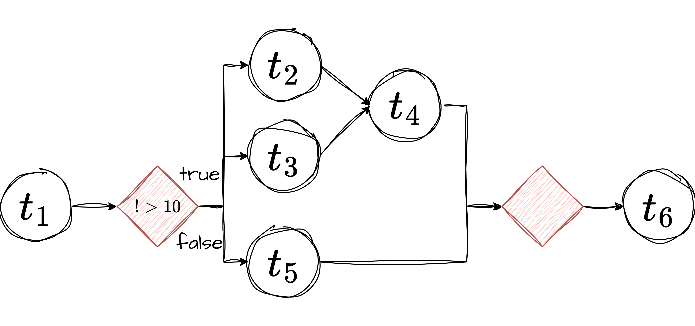

## Branching

This example demonstrates an AWPL application that introduces conditional execution using a branch construct. 



After the first task 
(`t_1`) completes, the application evaluates the specified condition and routes execution into one of two possible branches 
(`true` or `false`).

The condition checks whether the output field `$t_1.field` is greater than `10`. Because `negation: true` is set, the condition 
is inverted, meaning the branch evaluates to true when the value is not greater than `10`.

If the condition evaluates to true, tasks `t_2`, `t_3`, and `t_4` will be executed. Task `t_4` depends on the completion 
of `t_2` and `t_3`.

If the condition evaluates to false, only task `t_5` will be executed.

Regardless of which branch is taken, task `t_6` will eventually execute, as it depends on the branch node itself (`branch_1`), 
ensuring that downstream tasks continue after branching. The user needs to make sure that `t_6` can operate regardless of which
branch is executed.

```yaml
---
name: "branching"
runtime: "airflow"
config:
  resource_hints: []
  slo: []
  runtime:
    schedule: "@daily"
nodes:
  - task:
      id: "t_1"
      description: "The first task of the application."
      task_config: {}           # using Airflow EmptyOperator 
      depends_on: []
  - branch:
      id: "branch_1"
      description: "This is a conditional branch"
      conditions:
        - lhs: "$t_1.field"
          rhs: "10"
          operator: ">"
          negation: true
      branches:
        true:
          - task:
              id: "t_2"
              task_config: {}
              depends_on: []
          - task:
              id: "t_3"
              task_config: {}
              depends_on: []
          - task:
              id: "t_4"
              task_config: {}
              depends_on: 
                - "t_2"
                - "t_3"
        false:
          - task:
              id: "t_5"
              task_config: {}
              depends_on: []
      depends_on:
        - "t_1"
  - task:
      id: "t_6"
      task_config: {}
      depends_on: 
        - "branch_1"
```
