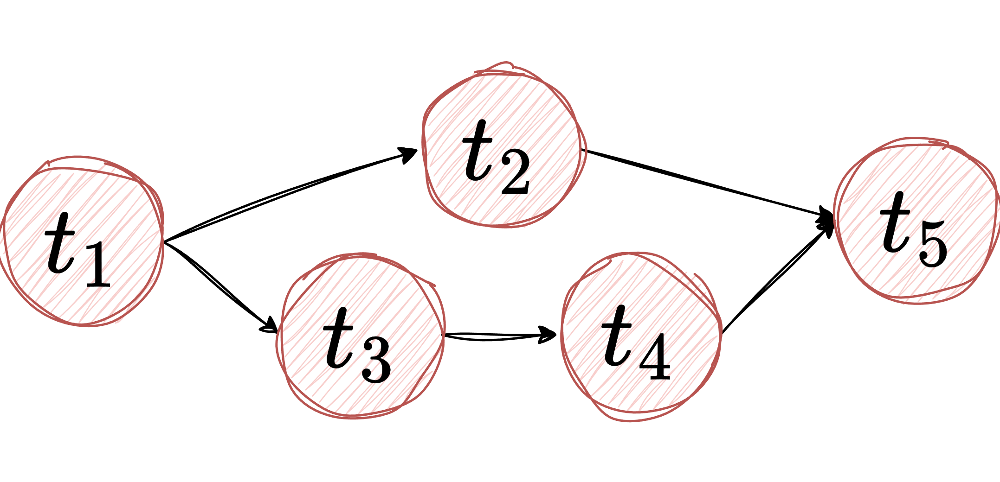

## Tasks Only

This example demonstrates an AWPL application that consists **exclusively of tasks**, without the use of branches, 
loops, or parallel constructs. It highlights how tasks can be connected through dependencies to form a directed acyclic 
graph (DAG).



Each task is uniquely identified by its `id`, may include a `description`, and declares dependencies on one or more upstream 
tasks via `depends_on`. Since no explicit execution logic (such as kubernetes pod operator or custom task implementations) is provided, 
the `task_config` is defined as an empty object (`{}`). In case of Apache Airflow, this translates to the use of 
the **EmptyOperator**, which allows the workflow structure to be validated and executed without performing any real computation.

```yaml
---
name: "taskOnly"
runtime: "airflow"
config:
  resource_hints: []
  slo: []
  runtime:
    schedule: "@daily"
nodes:
  - task:
      id: "t_1"
      description: "The first task of the application."
      task_config: {}           # using Airflow EmptyOperator 
      depends_on: []
  - task:
      id: "t_2"
      task_config: {}
      depends_on: 
        - "t_1"
  - task:
      id: "t_3"
      task_config: {}
      depends_on: 
        - "t_1"
  - task:
      id: "t_4"
      task_config: {}
      depends_on: 
        - "t_3"
  - task:
      id: "t_5"
      task_config: {}
      depends_on: 
        - "t_2"
        - "t_4"
```
